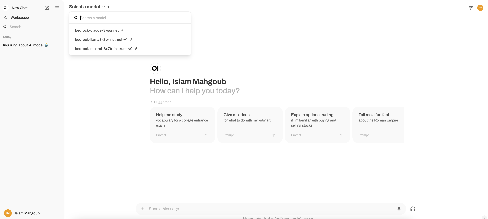

# How to use LiteLLM to easily migrate to Amazon Bedrock
Some organisations have already built applications that work with OpenAI compatible API and would like to switch to Amazon Bedrock -- this implementation shows how you can do that without changing app code using LiteLLM.

## Architecture
The diagram below depicts the solution architecture. [LiteLLM](https://www.litellm.ai/) is used as a proxy to translate the API call originating from the app in OpenAI format to Bedrock format.


LiteLLM is deployed on Amazon EKS. If the app is hosted on the same cluster, it can access LiteLLM internally through Kubernetes `Service` of `type` `ClusterIP`. If the app is hosted outside the cluster, LiteLLM has to be exposed via a load balancer -- refer to [Exposing applications](https://www.eksworkshop.com/docs/fundamentals/exposing/) section of Amazon EKS workshop for guidance. This implementation assumes the app is hosted on the same cluster.

While LiteLLM is only used as a proxy in this implementation, it has several other features e.g. retry/fallback logic across multiple deployments, track spend & set budgets per project, etc.

## Implementation

**NOTE:** The implementation has been tested on Cloud9/Amazon Linux. Make sure to disable AWS managed temporary credentials and attach an IAM role with sufficient permissions.

### Configure environment variables 
1. Configure environment variables
```sh
export TOKEN=`curl -X PUT "http://169.254.169.254/latest/api/token" -H "X-aws-ec2-metadata-token-ttl-seconds: 21600"`
export AZ=`curl -H "X-aws-ec2-metadata-token: $TOKEN" http://169.254.169.254/latest/meta-data/placement/availability-zone`
export AWS_REGION=`echo $AZ | sed 's/\(.*\)[a-z]/\1/'`
export CLUSTER_NAME="litellm-demo"
echo "export AWS_REGION=${AWS_REGION}" | tee -a ~/.bash_profile
echo "export CLUSTER_NAME=${CLUSTER_NAME}" | tee -a ~/.bash_profile
```
### Install Kubernetes tools

2. Install eksctl:
```sh
# for ARM systems, set ARCH to: `arm64`, `armv6` or `armv7`
ARCH=amd64
PLATFORM=$(uname -s)_$ARCH

curl -sLO "https://github.com/eksctl-io/eksctl/releases/latest/download/eksctl_$PLATFORM.tar.gz"

# (Optional) Verify checksum
curl -sL "https://github.com/eksctl-io/eksctl/releases/latest/download/eksctl_checksums.txt" | grep $PLATFORM | sha256sum --check

tar -xzf eksctl_$PLATFORM.tar.gz -C /tmp && rm eksctl_$PLATFORM.tar.gz

sudo mv /tmp/eksctl /usr/local/bin
```

3. Install kubectl:
```sh
curl -O https://s3.us-west-2.amazonaws.com/amazon-eks/1.30.0/2024-05-12/bin/linux/amd64/kubectl
chmod +x ./kubectl
mkdir -p $HOME/bin && cp ./kubectl $HOME/bin/kubectl && export PATH=$HOME/bin:$PATH
```

4. Install yq:
```sh
echo 'yq() {
  docker run --rm -i -v "${PWD}":/workdir mikefarah/yq "$@"
}' | tee -a ~/.bashrc && source ~/.bashrc
```

5. Install Helm:
```sh
curl -fsSL -o get_helm.sh https://raw.githubusercontent.com/helm/helm/main/scripts/get-helm-3
chmod 700 get_helm.sh
./get_helm.sh
```
### Create an EKS cluster
6. Create cluster:
```sh
envsubst < bedrock-litellm/eksctl/cluster-config.yaml | eksctl create cluster -f -
```

### Install LiteLLM

7. Clone LiteLLM
```sh
git clone https://github.com/BerriAI/litellm.git
```

8. Create an IAM OIDC provider for the cluster to be able to use [IAM roles for service accounts](https://docs.aws.amazon.com/eks/latest/userguide/iam-roles-for-service-accounts.html) (required for granting IAM permissions to LiteLLM to be able to invoke Bedrock models):
```sh
eksctl utils associate-iam-oidc-provider --cluster $CLUSTER_NAME --approve
```
9. Create IRSA dependencies for LiteLLM

First, create IAM policy:
```sh
export LITELLM_BEDROCK_IAM_POLICY_ARN=$(aws iam create-policy \
   --policy-name litellm-bedrock-policy \
   --policy-document file://bedrock-litellm/iam/litellm-bedrock-policy.json \
   --output text \
   --query "Policy.Arn")
echo "export LITELLM_BEDROCK_IAM_POLICY_ARN=${LITELLM_BEDROCK_IAM_POLICY_ARN}" | tee -a ~/.bash_profile
```

Then, create IRSA setup:
```sh
eksctl create iamserviceaccount \
    --name litellm-sa \
    --cluster $CLUSTER_NAME \
    --role-name AmazonEKS_LiteLLM_Role \
    --attach-policy-arn $LITELLM_BEDROCK_IAM_POLICY_ARN \
    --approve
```
10. Install LiteLLM

**NOTE:** LiteLLM helm chart is currently BETA, hence K8s manifests were used for installation. The snippet below will be changed once the helm chart is GAed.

```sh
yq -i '.spec.template.spec.serviceAccount= "litellm-sa"' litellm/deploy/kubernetes/kub.yaml
yq -i 'del(.spec.template.spec.containers[0].env[] | select(.name == "DATABASE_URL") )' litellm/deploy/kubernetes/kub.yaml
yq -i '.spec.type= "ClusterIP"' litellm/deploy/kubernetes/service.yaml

kubectl create configmap litellm-config --from-file=bedrock-litellm/litellm/proxy_config.yaml
kubectl apply -f litellm/deploy/kubernetes/kub.yaml
kubectl apply -f litellm/deploy/kubernetes/service.yaml
```

11. Verify LiteLLM
```sh
kubectl run curl --image=curlimages/curl --rm -it -- /bin/sh
curl --location 'http://litellm-service.default.svc.cluster.local:4000/chat/completions' \
    --header 'Content-Type: application/json' \
    --header 'Authorization: Bearer sk-1234' \
    --data '{
    "model": "bedrock-llama3-8b-instruct-v1",
    "messages": [
        {
        "role": "user",
        "content": "what llm are you"
        }
    ]
}'
```
### Use Open WebUI to test the setup

[Open WebUI]() is a web frontend that allows users to interact with LLMs. It supports locally running LLMs using Ollama, and OpenAI-compatible remote endpoints. In this implementation, we are configuring a remote endpoint that points to LiteLLM to show how LiteLLM allowed for accessing Bedrock through OpenAI-compatible interface. 

12. Install EBS CSI driver (EBS volumes will be used to store Open WebUI state):

First, create IRSA dependencies:
```sh
eksctl create iamserviceaccount \
    --name ebs-csi-controller-sa \
    --namespace kube-system \
    --cluster $CLUSTER_NAME \
    --role-name AmazonEKS_EBS_CSI_DriverRole \
    --attach-policy-arn arn:aws:iam::aws:policy/service-role/AmazonEBSCSIDriverPolicy \
    --approve
```
Then, install EBS CSI driver helm chart:
```sh
helm repo add aws-ebs-csi-driver https://kubernetes-sigs.github.io/aws-ebs-csi-driver
helm repo update
helm upgrade --install aws-ebs-csi-driver \
    --namespace kube-system \
    --set controller.serviceAccount.create=false \
    aws-ebs-csi-driver/aws-ebs-csi-driver
```

13. Install Open WebUI:
```sh
helm repo add open-webui https://helm.openwebui.com/
helm repo update

helm upgrade \
    --install open-webui open-webui/open-webui \
    --namespace open-webui \
    --set persistence.storageClass=gp2 \
    --set service.type=LoadBalancer \
    --set pipelines.enabled=false \
    --create-namespace
```

14. Extract Open WebUI URL:
```sh
kubectl -n open-webui get svc open-webui  -o jsonpath='{.status.loadBalancer.ingress[*].hostname}'
```

15. Sign-up (first signed up user get admin access), then go to User icon at top right, settings, admin settings, connections, then edit OpenAI API to be as follows:

```sh
http://litellm-service.default.svc.cluster.local:4000/v1
```

Click on "Verify connection" button to make sure connectivity is in-place, then save. You should be able to see three of the Bedrock models available in Open WebUI as depicted in the screenshot below:



Edit `litellm/proxy_config.yaml` to enable more Bedrock models on LiteLLM.

## Clean-up
1. Uninstall Open WebUI:
```sh
helm uninstall open-webui --namespace open-webui
```

2. Uninstall LiteLLM
```sh
kubectl delete -f litellm/deploy/kubernetes/service.yaml
kubectl delete -f litellm/deploy/kubernetes/kub.yaml
eksctl delete iamserviceaccount \
    --name litellm-sa \
    --cluster $CLUSTER_NAME
aws iam delete-policy --policy-arn $LITELLM_BEDROCK_IAM_POLICY_ARN
```

3. Uninstall EBS driver
```sh
helm uninstall aws-ebs-csi-driver \
    --namespace kube-system
eksctl delete iamserviceaccount \
    --name ebs-csi-controller-sa \
    --cluster $CLUSTER_NAME
```

4. Delete cluster
```sh
eksctl delete cluster --name $CLUSTER_NAME
```

## Security

See [CONTRIBUTING](CONTRIBUTING.md#security-issue-notifications) for more information.

## License

This library is licensed under the MIT-0 License. See the LICENSE file.

